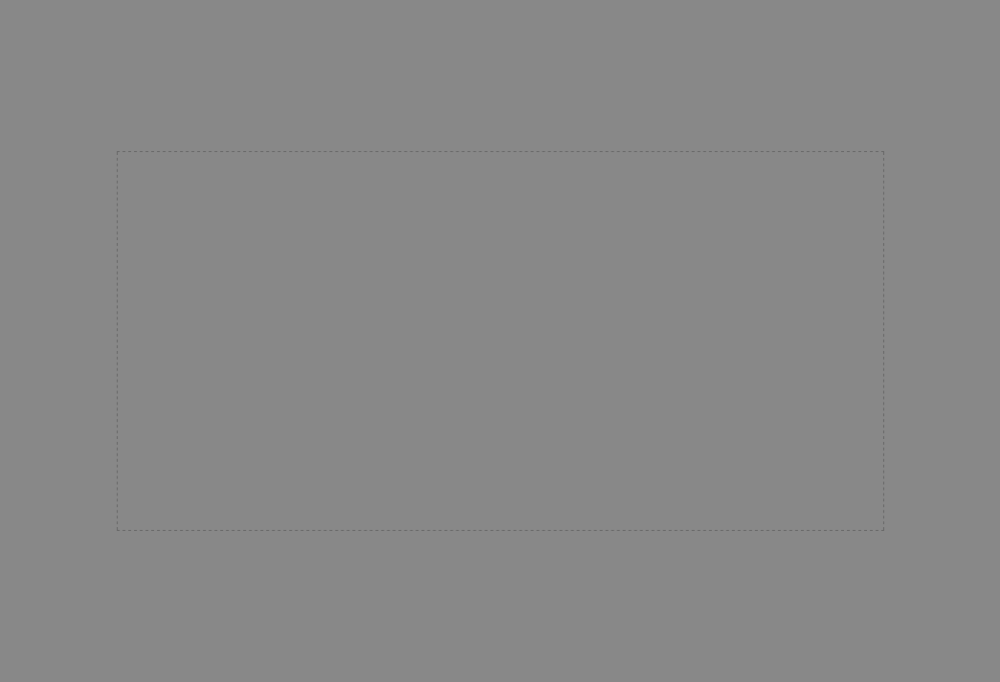
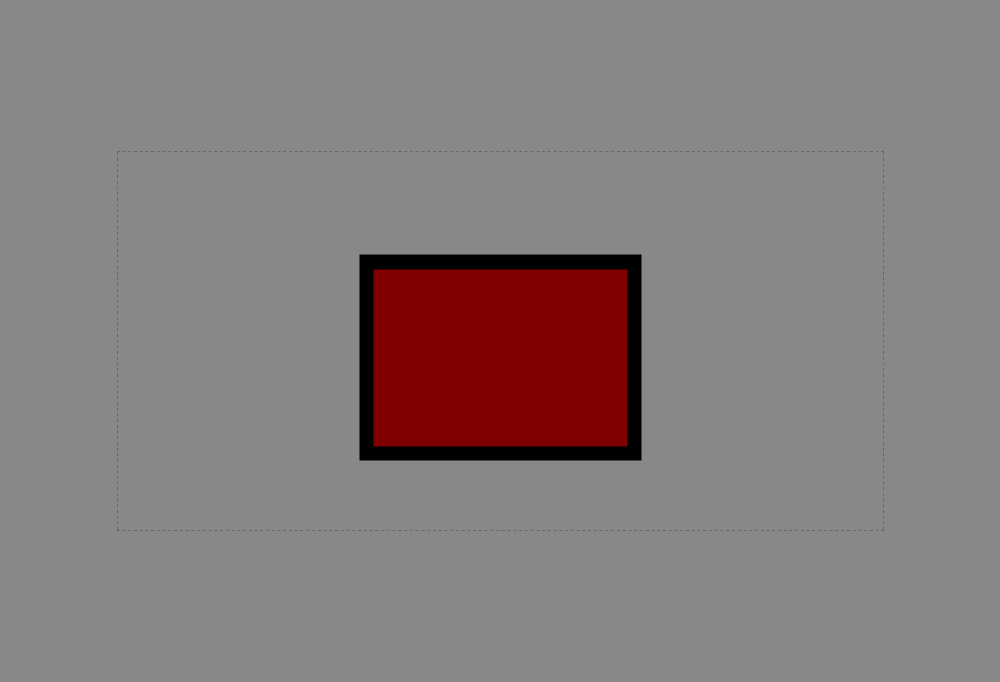
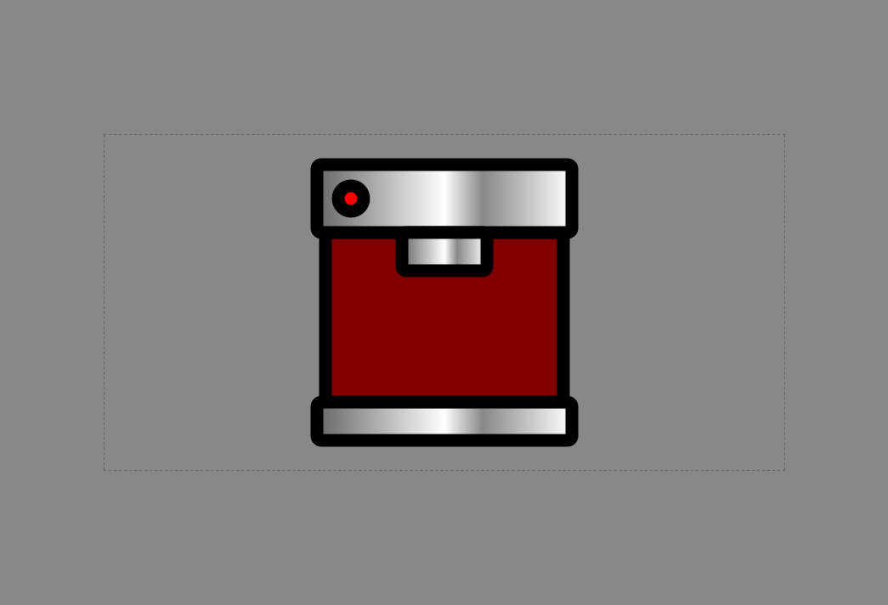
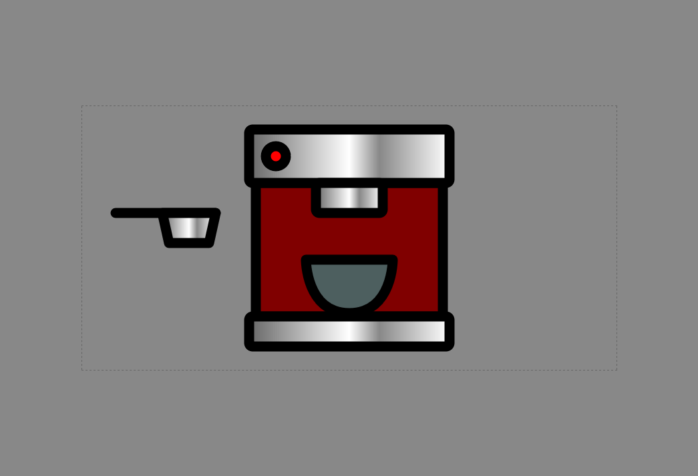
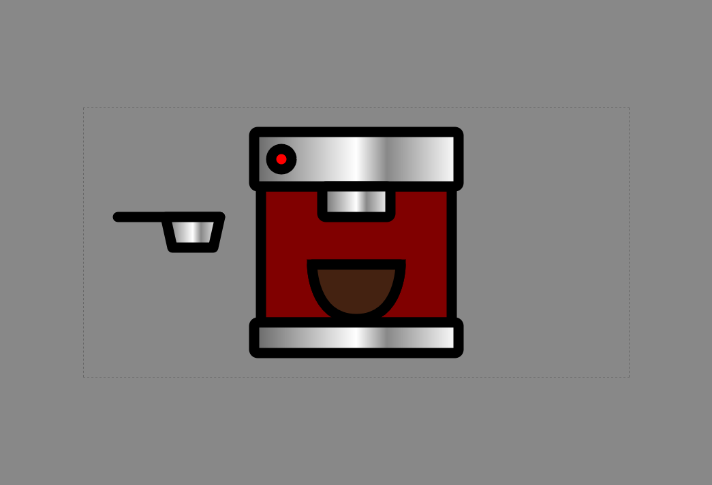
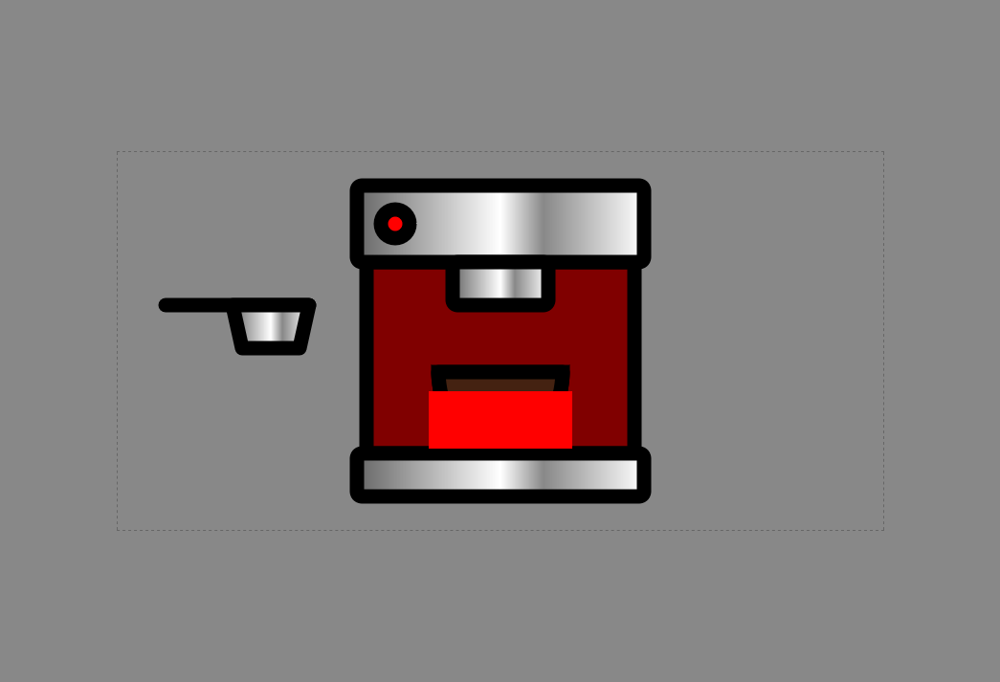
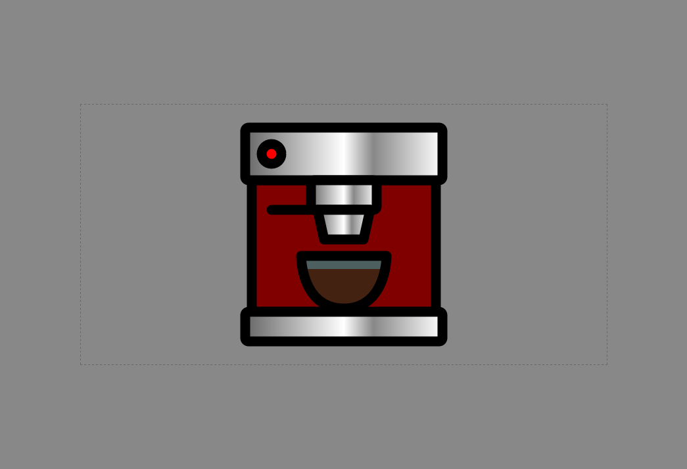
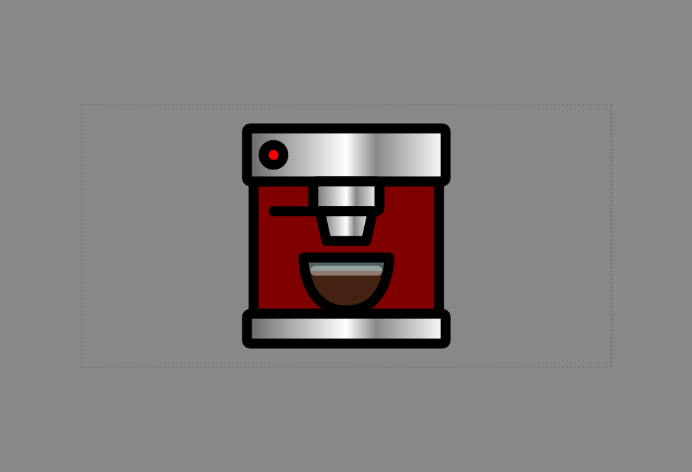

*289.212.09.workshop*

<!-- markdown-pdf -s md.css -h md.js notes.md -m '{"html":true}' -->

SVG
===

Scalable Vector Graphics (SVG) is an XML-based markup language for describing two-dimensional based vector graphics. SVG is, essentially, to graphics what HTML is to text.  
-- https://developer.mozilla.org/en-US/docs/Web/SVG

In this lesson, you'll look at writing SVG code to draw shapes. To animate the shapes, we'll employ a JavaScript named GSAP.

We'll use various SVG elements, but only a small subset of what is available. For a complete reference of SVG elements and attributes, you can refer to the MDN documentation:

* https://developer.mozilla.org/en-US/docs/Web/SVG/Element
* https://developer.mozilla.org/en-US/docs/Web/SVG/Attribute

You can add SVG images to web-pages in various ways. For this task, we'll use an *inline* approach (writing the SVG code among our HTML).

https://developer.mozilla.org/en-US/docs/Learn/HTML/Multimedia_and_embedding/Adding_vector_graphics_to_the_Web

There are SVG attributes to control how your SVG graphics scale / respond to resizing. Many vector graphics editors provide export options to set these parameters, although you can code these manually.


Setup an HTML Document
----------------------

This initial structure will include a link to a GSAP CDN-hosted file. To keep things simple, we'll use an internal stylesheet and internal JavaScript:

```
<!DOCTYPE html>

<html>

  <head>

    <meta charset="utf-8" />
    <title>212 Coffee</title>
    <script src="https://cdnjs.cloudflare.com/ajax/libs/gsap/2.1.3/TweenMax.min.js"></script>

    <style>
    </style>

  </head>

  <body>

    <script>
    </script>

  </body>

</html>
```

We'll recreate the following graphic using SVG markup:


SVG
---

To begin creating shapes, add an `svg` tag; this will serve as your 'drawing space'. Use `width` and `height` attributes to define the size:

```
  ...

  <body>

    <svg width="800" height="395">

    </svg>

    <script>
    ...
```

Add some CSS to style the background and outline the SVG element:

```
    ...

    <style>
      html, body {
        align-items: center;
        background-color: #888;
        display: flex;
        height: 100%;
        justify-content: center;
      }
      svg {
        outline: 1px dashed #666;
      }
    ...
```



We are now ready to add some shapes.

### Rectangles ###

Use the `<rect>` tag to draw a rectangle:

```
    <svg width="800" height="395">

      <rect x="260" y="115" width="280" height="200" fill="maroon" class="stroked" />

    </svg>
```

The attributes (`x`, `y`, `width`, `height`, `fill`) should be self-explanatory. The `class` attribute is for applying some CSS styling. Add this corresponding rule to your internal stylesheet:

```
      ...

      svg .stroked {
        stroke: #000;
        stroke-width: 15;
      }
    </style>
```



Most properties can be applied using inline attributes or CSS. Depending on what you wish to accomplish, you may elect one approach over the other. It's a bit tedious defining a one-off style for each element. If you're styling multiple elements the same way, a class can be far more efficient.

### Gradient Fills ###

You can apply gradient fills using the `linearGradient` tag. This is a two-step process:

1. you define the colour-stops using `stop` tags;
2. then reference the gradient by its `id` attribute. In this case, the `linearGradient` has an `id="steel"`, which you can apply to any shape using a `fill="url(#steel)"` attribute:

```
      ...

      <linearGradient id="steel">
        <stop offset="0%"   style="stop-color:#666" />
        <stop offset="50%"  style="stop-color:#FFF" />
        <stop offset="65%"  style="stop-color:#888" />
        <stop offset="100%" style="stop-color:#FFF" />
      </linearGradient>
      <rect x="250" y="35"  rx="5" ry="5" width="300" height="80" class="stroked" fill="url(#steel)" />
      <rect x="250" y="315" rx="5" ry="5" width="300" height="45" class="stroked" fill="url(#steel)" />
      <rect x="350" y="115" rx="5" ry="5" width="100" height="45" class="stroked" fill="url(#steel)" />
    </svg>
```


### Ellipses ###

Add an ellipse just above your final rectangle:

```
      ...
      <ellipse cx="290" cy="75" rx="15" ry="15" id="startbutton"  class="stroked" fill="#F00" />
      <rect x="350" y="115" rx="5" ry="5" width="100" height="45" class="stroked" fill="url(#steel)" />
    </svg>
```



### Paths ###

Think of this as your SVG pen/bezier tool.

Add a new path element:

```
      ...
      <path
        stroke-linejoin="round"
        class="stroked"
        fill="#0EE" fill-opacity="0.4"
        id="cup"
        d="M335 230
           L465 230
           C465 230, 465 310, 400 310
           C335 310, 335 230, 335 230
           Z"
      />
    </svg>
```

The result is a cup shape:


The `d` attribute uses various commands to construct paths:

Command                      | Operation
-----------------------------|-----------------------
`M`, `m`                     | move to
`L`, `l`, `H`, `h`, `V`, `v` | line to
`C`, `c`, `S`, `s`           | cubic bezier curve
`Q`, `q`, `T`, `t`           | quadratic bezier curve
`A`, `a`                     | elliptical arc curve
`Z`, `z`                     | close path

For more on path commands, refer to the MDN docs:  
https://developer.mozilla.org/en-US/docs/Web/SVG/Attribute/d#Path_commands

It's probably best to draw paths using something like Inkscape or Illustrator, rather than write them by hand.

### Groups ###

The group tag (`<g>`) groups elements. This makes for a convenient way to manipulate multiple elements.

Add the *portafilter* (handle thing with the coffee grounds in it), comprised of a `line` and polygon `element`:

```
      ...
      <g class="stroked" id="portafilter">
        <line x1="50" y1="160" x2="200" y2="160" stroke-linecap="round" />
        <polygon
          stroke-linejoin="round"
          fill="url(#steel)"
          points="120,160
                  130,205
                  190,205
                  200,160"
        />
      </g>
    </svg>
```



For more on `<line />` and `<polygon />`, refer to the relevant documentation:

* https://developer.mozilla.org/en-US/docs/Web/SVG/Element/line
* https://developer.mozilla.org/en-US/docs/Web/SVG/Element/polygon

### Clipping Path ###

A clipping path provides a way to cut one shape out of another shape. We'll construct an example using a few steps to understand better how this works.

Firstly, let's 'fill' the mug with coffee by creating another (brown) mug-shaped path:

```
      ...
      <path
        clip-path="url(#cupmask)"
        class="stroked"
        fill="#421"
        d="M335 230
           L465 230
           C465 230, 465 310, 400 310
           C335 310, 335 230, 335 230
           Z"
      />
    </svg>
```

Note the `clip-path="url(#cupmask)"` -- this will apply the relevant clipping mask (we have yet to define).



Now, add a rectangle:

```
      ...
      <rect id="cuplevel" x="325" y="250" width="150" height="60" fill="#F00" />
    </svg>
```



Okay, so it looks a bit odd. However, the bright red rectangle will serve as the clipping path -- in other words, wherever it overlaps the brown shape, the brown will show through. Now convert this `rect` to an actual clipping path:

```
      ...
      <defs>
        <clipPath id="cupmask">
          <rect id="cuplevel" x="325" y="250" width="150" height="60" fill="#F00" />
        </clipPath>
      </defs>
    </svg>
```

Note the `id="cupmask"` (referenced in the clipped/brown shape).


We're now ready to apply some interactivity and animation to the image.

SVG Transformations
-------------------

Although not covered in this lesson, it's good to know about SVG transformations. These provide a simple way to *translate*, *rotate*, *skew*, and *scale* groups or individual shapes:  
https://developer.mozilla.org/en-US/docs/Web/SVG/Tutorial/Basic_Transformations


SVG Animation and Interactivity
===============================

By clicking on various parts of the machine, you will trigger different animations. This will be accomplished using JavaScript with GSAP library functions for handling animation.

Note that there are many ways to animate SVG elements -- natively (CSS, rAF, WAAPI) and using other JavaScript libraries (Anime, Mo, p5, Snap). For additional guidance on using GSAP, you can refer to the official documentation:  
https://greensock.com/docs/TweenMax

To begin, add some CSS to change the cursor to a pointer whenever it hovers over some (soon-to-be) clickable element:

```
      ...

      #portafilter, #startbutton, #cup {
        cursor: pointer;
      }
    </style>
```

You have the GSAP library linked in the `head` of your HTML, and an empty pair of `script` tags (just before the closing `</body>` tag) for adding your JavaScript code. Let's begin with an event listener -- which works exactly the same way as it would with HTML:

```
    <script>
      document.getElementById('portafilter').addEventListener('click', function dockPortafilter() {
        alert('clicked');
      });
    </script>
```

Clicking the portafilter prompts an alert that reads 'clicked'.

SVG is part of the DOM, so JavaScript does pretty much all the same things in SVG as it does in HTML.

Replace the `alert` with some tween code:

```
    <script>
      document.getElementById('portafilter').addEventListener('click', function dockPortafilter() {
        TweenMax.to('#portafilter', 1, {x:240});
        this.removeEventListener('click', dockPortafilter);
        this.style.cursor = 'default';
      });
    </script>
```

Now, clicking the portafilter moves it into position above the mug, performing a smooth tween in the process. The `TweenMax.to('#portafilter', 1, {x:240})` tweens the `'#portafilter'` from its current location to a new x-coordinate of `240`, taking `1` second to complete the motion.



Once this motion is complete, we can press the red button. To add the event listener for the red button after the tween is complete, we will use a *callback* function. Add this as an additional parameter to your existing `TweenMax.to`:

```
        ...
        TweenMax.to('#portafilter', 1, {x:240, onComplete:activateButton});
        ...
```

This specifies that once the tween is finished, JavaScript must call a function named `activateButton`. Add this function to your script, and set the `y` attribute of the coffee in the mug to `310` (to have it start empty):

```
        ...
          <rect id="cuplevel" x="325" y="310" width="150" height="60" fill="#F00" />
        ...

      ...
      let sb = document.getElementById('startbutton');

      function activateButton() {
        sb.setAttribute('fill','#0F0');
        sb.addEventListener('click', function greenStartButton() {
          TweenMax.to('#cuplevel', 2, {y:-60});
          this.removeEventListener('click', greenStartButton);
          this.style.cursor = 'default';
        });
      }
    </script>
```

The `activateButton()` function sets the button to green and adds a new event listener to it. Pressing this button (only possible once it turns green) will fill the mug:


Next, add another callback:

```
        ...
          TweenMax.to('#cuplevel', 2, {y:-60, onComplete:deactivateButton});
          ...
```

And a corresponding function to add some frothy milk to the mug:

```
      function deactivateButton() {
        sb.setAttribute('fill','#F00');
        document.getElementById('cup').addEventListener('click', function addMilk() {
          let milk = document.createElementNS('http://www.w3.org/2000/svg','line')
          milk.setAttribute('stroke', '#FFF');
          milk.setAttribute('stroke-opacity', '0.4');
          milk.setAttribute('stroke-width', '15');
          milk.setAttribute('stroke-linecap', 'round');
          milk.setAttribute('x1', 353);
          milk.setAttribute('y1', 250);
          milk.setAttribute('x2', 447);
          milk.setAttribute('y2', 250);
          document.querySelector('svg').appendChild(milk);
          this.removeEventListener('click', addMilk);
          this.style.cursor = 'default';
        });
      }
    </script>
```

Save, refresh your browser, and run through the click-sequence again; finally, click on the mug to add the milk.



Tasks
-----

Add the following features:

* display a stream of coffee, from the portafilter to the mug, while the mug is filling-up;
* when you click on the finished mug (with the milk), the process should reset.


212 Arcade
==========

Convert your *212 Arcade* div-based graphs to an SVG solution, as per this code:

https://github.com/tabreturn/tutorial-212-arcade/tree/master/lesson_03

*end*
